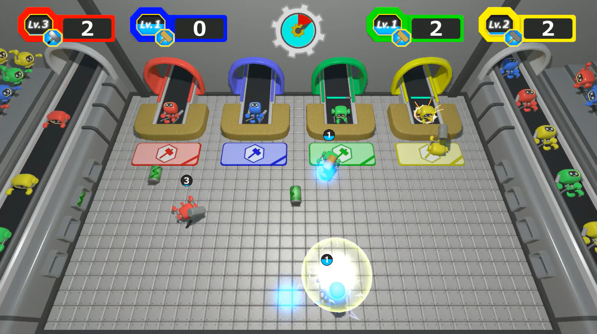
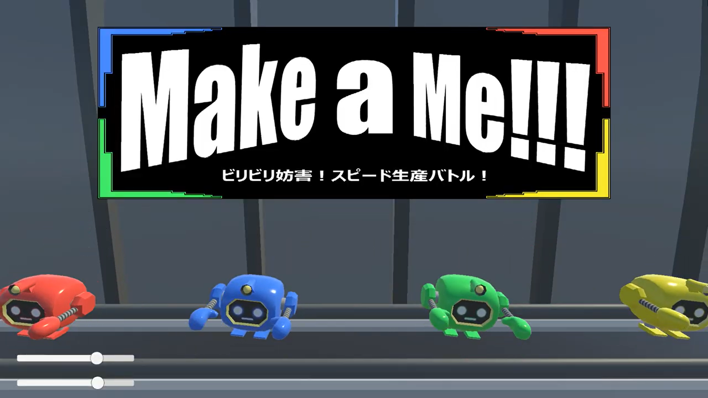
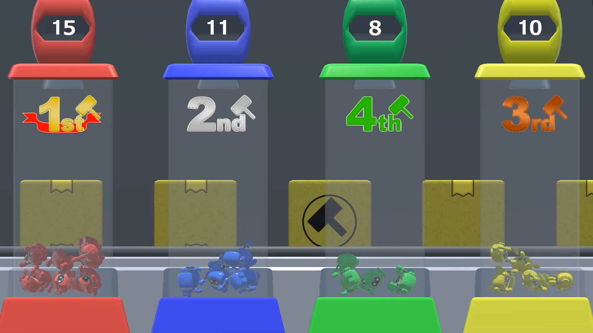

# Make a Me
プレイ動画：https://drive.google.com/drive/folders/18FB3ESFhk0M8HYl5oyPXwcpDE8lD3RUf?usp=drive_link

## ゲーム画面
|プレイ画面|タイトル画面|リザルト画面|
|:----------:|:----------:|:----------:|
||||

## ファイル構成
* [Unityデータ](./ProjectData/)
* [ビルドデータ](./BuildData/)

## 概要
進級制作で作った作品を、TGSに向けて改良した作品です。戦略性と分かりやすさの両立を目指しました。

|項目|説明|
|:--:|:--|
|**ジャンル**|4人対戦パーティーゲーム|
|**プラットフォーム**|WindowsPC (NintendoSwitchProコントローラーのみ対応)|
|**Unityバージョン**|Unity 2022.3.24f1|
|**制作期間**|2025年9月 約1カ月|
|**制作人数**|5人(プログラマー3人、デザイナー2人)|

## ゲームルール
作業場に入り、自分のロボットを一番多く作るゲーム。  
バッテリーを持つことでエネルギーをチャージし、一定数貯まると自身をレベルアップ。  
レベルアップすることで作業効率を上げたり、バッテリーを相手に投げつけて妨害したりしながら  
ワイワイと楽しめるゲームです。

## 担当プログラム
* [プレイヤーの制御](./ProjectData/Assets/Maeda/Scripts/PlayerController.cs)
  * RotateTowardsメソッドを使い、プレイヤーの回転をなめらかにしました。

* [バッテリーの取得制御](./ProjectData/Assets/Maeda/Scripts/TakeRange.cs)
  * プレイヤー4人分の当たり判定が複雑に絡むので、Nullエラー処理、所持判定を二重で行いました。

* [バッテリーのキャッチ制御](./ProjectData/Assets/Maeda/Scripts/CatchRange.cs)
  * テストプレイ時にキャッチの難易度が高かったため、取得範囲より大きいコライダーを別で設けました。
  * 取得制御と被らないように、バッテリーが投げられた状態かを判定しました。

* [ゲーム進行管理](./ProjectData/Assets/Maeda/Scripts/GameController.cs)
  * コルーチンやbool使い、ゲームの進行を一括で管理しました。

* [スコア管理](./ProjectData/Assets/Maeda/Scripts/ScoreManager.cs)
  * 構造体を使ってプレイヤーのスコア・順位を管理し、順位に応じて配列の並べ替えを行いました。

* UIアニメーション
  * コルーチンを使い、UIのアニメーション実装しました。
	* [シャッター](./ProjectData/Assets/Maeda/Scripts/ShutterScript.cs)
	  * 開閉時間をインスペクターから調整できるようにしました。
	* [時計](./ProjectData/Assets/Maeda/Scripts/TimerScript.cs)
	  * 外側の歯車と内側の歯車の回転速度を調整し、噛み合いを表現しました。

* [音源管理](./ProjectData/Assets/Maeda/Scripts/AudioManager.cs)
  * 音源を一括で管理し、メソッドとして再生・停止を任意のタイミングで呼べるようにしました。
  * AudioMixerを使い、BGM・SEに分けてスライダーで音量調整できるようにしました。

## 東京ゲームショウ2025出展
目的
* 他校のブースや作品と比較する
* 自分たちの作品を不特定多数の人に遊んでもらい、アンケートを取る。
* 他の出展校の学生や業界関係者から改善案や意見をもらう。
* 今後の制作に活かす。

目標
* 230人のお客様に遊んでもらう。
* 100％のお客様に「面白い」、「分かりやすい」と感じてもらう。

目標達成のために、「被り物で興味を持ってもらう→ポスターやプレイ動画でやってみたいと思ってもらう」という流れを作りました。

結果
* 来客数：53人
* アンケート結果(5段階評価)  
 「面白い」5：35人  4：13人  3：5人  
 「分かりやすい」5：30人  4：14人  3：6人  2：2人

 |出展の様子|
 |:-:|
 ||||

感想
* hogehoge

## IT未来フェスタ in ResorTech EXPO2025出展

## 制作中の問題とその解決
