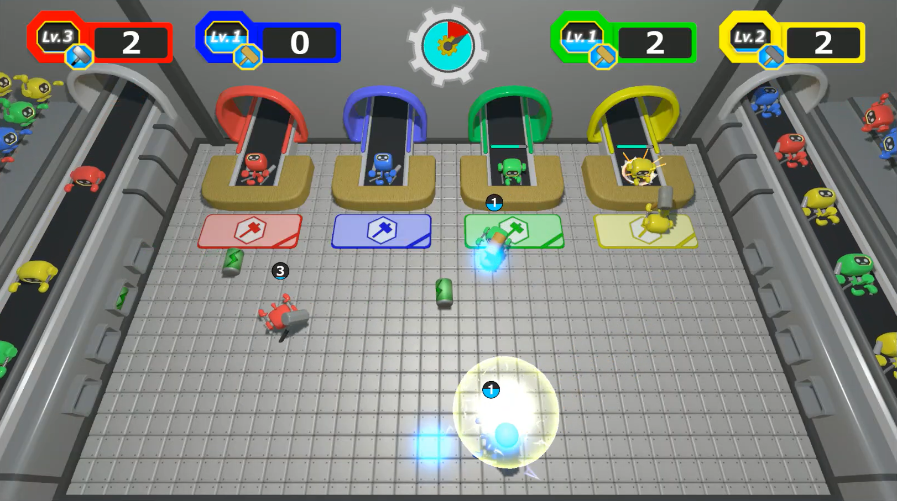
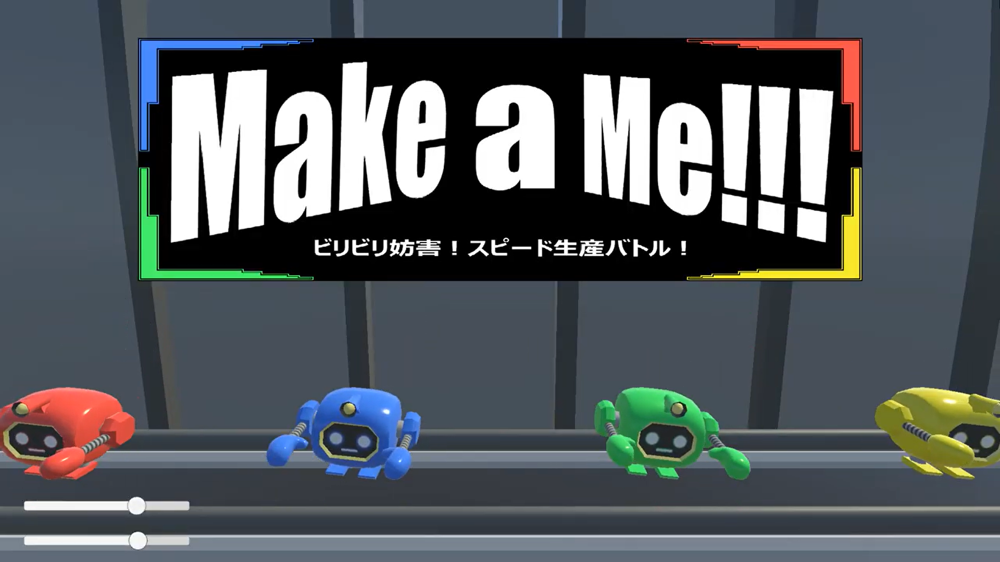
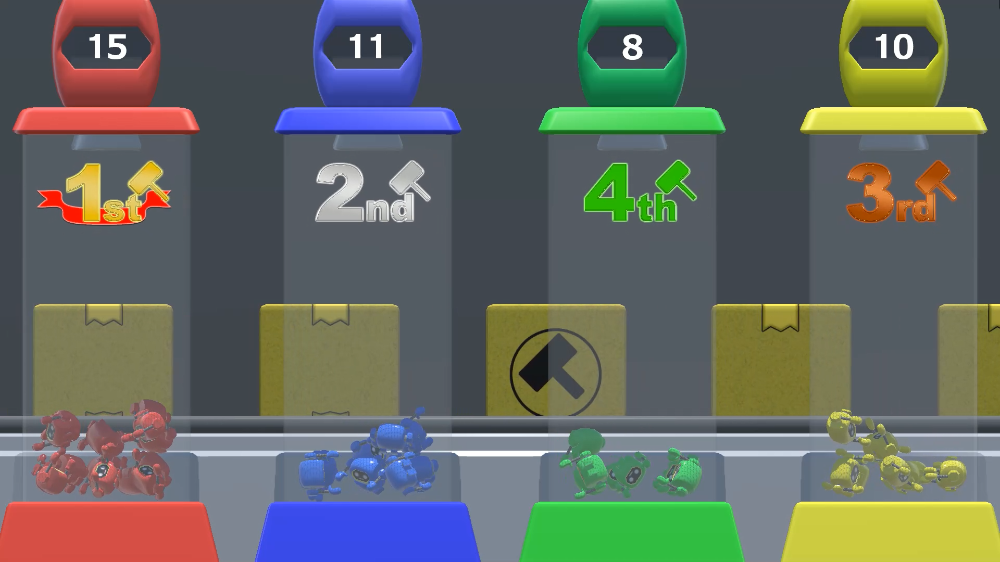
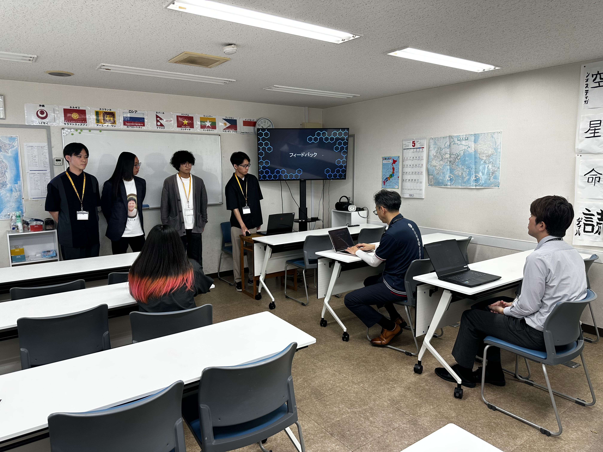
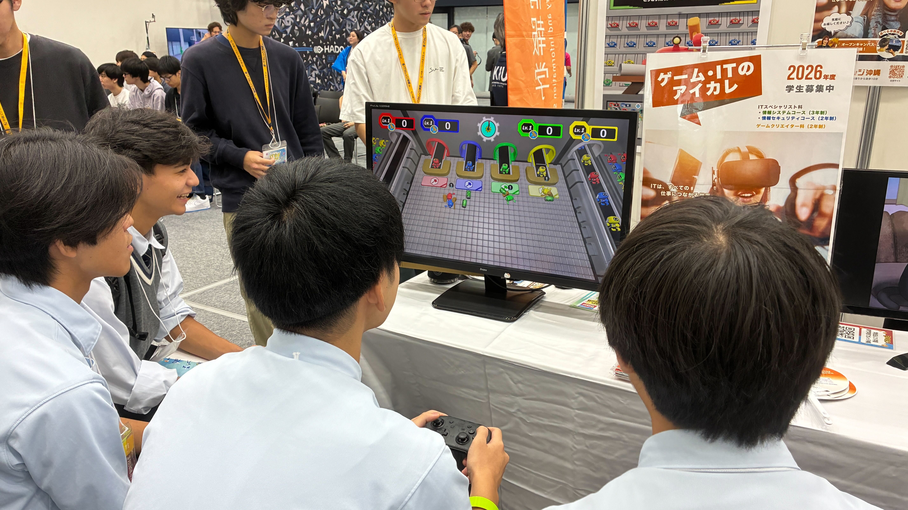

# Make a Me
プレイ動画：https://drive.google.com/drive/folders/18FB3ESFhk0M8HYl5oyPXwcpDE8lD3RUf?usp=drive_link

## ゲーム画面
|プレイ画面|タイトル画面|リザルト画面|
|:----------:|:----------:|:----------:|
||||

## ファイル構成
* [Unityデータ](./ProjectData/)
* [ビルドデータ](./BuildData/)

## 概要
進級制作で作った作品を、TGSに向けて改良した作品です。戦略性と分かりやすさの両立を目指しました。

|項目|説明|
|:--:|:--|
|**ジャンル**|4人対戦パーティーゲーム|
|**プラットフォーム**|WindowsPC (NintendoSwitchProコントローラーのみ対応)|
|**Unityバージョン**|Unity 2022.3.24f1|
|**制作期間**|2025年9月 約1カ月|
|**制作人数**|5人(プログラマー3人、デザイナー2人)|

## ゲームルール
作業場に入り、自分のロボットを一番多く作るゲーム。  
バッテリーを持つことでエネルギーをチャージし、一定数貯まると自身をレベルアップ。  
レベルアップすることで作業効率を上げたり、バッテリーを相手に投げつけて妨害したりしながら  
ワイワイと楽しめるゲームです。

## 担当プログラム
* [プレイヤーの制御](./ProjectData/Assets/Maeda/Scripts/PlayerController.cs)
  * RotateTowardsメソッドを使い、プレイヤーの回転をなめらかにしました。

* [バッテリーの取得制御](./ProjectData/Assets/Maeda/Scripts/TakeRange.cs)
  * プレイヤー4人分の当たり判定が複雑に絡むので、Nullエラー処理、所持判定を二重で行いました。

* [バッテリーのキャッチ制御](./ProjectData/Assets/Maeda/Scripts/CatchRange.cs)
  * テストプレイ時にキャッチの難易度が高かったため、取得範囲より大きいコライダーを別で設けました。
  * 取得制御と被らないように、バッテリーが投げられた状態かを判定しました。

* [ゲーム進行管理](./ProjectData/Assets/Maeda/Scripts/GameController.cs)
  * コルーチンやbool使い、ゲームの進行を一括で管理しました。

* [スコア管理](./ProjectData/Assets/Maeda/Scripts/ScoreManager.cs)
  * 構造体を使ってプレイヤーのスコア・順位を管理し、順位に応じて配列の並べ替えを行いました。

* UIアニメーション
  * コルーチンを使い、UIのアニメーション実装しました。
	* [シャッター](./ProjectData/Assets/Maeda/Scripts/ShutterScript.cs)
	  * 開閉時間をインスペクターから調整できるようにしました。
	* [時計](./ProjectData/Assets/Maeda/Scripts/TimerScript.cs)
	  * 外側の歯車と内側の歯車の回転速度を調整し、噛み合いを表現しました。

* [音源管理](./ProjectData/Assets/Maeda/Scripts/AudioManager.cs)
  * 音源を一括で管理し、メソッドとして再生・停止を任意のタイミングで呼べるようにしました。
  * AudioMixerを使い、BGM・SEに分けてスライダーで音量調整できるようにしました。

## 東京ゲームショウ2025出展
**目的**
* 他校のブースや作品と比較する
* 自分たちの作品を不特定多数の人に遊んでもらい、アンケートを取る。
* 他の出展校の学生や業界関係者から改善案や意見をもらう。
* 今後の制作に活かす。

学校に出展意欲、出展協力願いのプレゼンテーションをしました。
|**プレゼンの様子**|
|:-:|
||

**目標**
* 230人のお客様に遊んでもらう。
* 100％のお客様に「面白い」、「分かりやすい」と感じてもらう。

目標達成のために、被り物やポスター、缶バッジ配布などで興味を持ってもらえるように工夫しました。

|**出展の様子**|
|:-:|
||

**結果**
* 来客数：64人(達成率28％)
* アンケート結果(5段階評価) 

|項目\評価|5|4|3|2|1|
|:--|:--:|:--:|:--:|:--:|:--:|
|面白い (人)|35|13|5|0|0|
|分かりやすい (人)|30|14|6|2|0|

**感想**
* 来客数の見通しが甘く、来場客の年齢層やグループの数、ブースの位置や大きさを十分に考慮できていませんでした。  
  今後目標を決める際は、影響を与える可能性のある要因を十分に考慮するべきだと感じました。
* 実際に遊んでもらうことでプレイ時間の長さや戦略性など新たに気づくことがあり、テストプレイの重要さを改めて実感しました。
* リプレイ数が非常に少なかったことは、ゲームの面白さをバッテリーアクションやレベルなどの要素の数に依存していたことが原因だと考えています。  
  その結果リプレイするほどの面白さにはならなかったのだと感じました。
* いただいた意見の中には、自分たちで気づけたはずの改善点もあり、自分たちの考え方のズレにも気づくことができました。  
  分かりやすさ・戦略性・ルールや見た目の納得感を追い求めすぎて納得のいく議論ができていなかったことが原因だと感じたので、今後はプロトタイプ段階や企画のコンセプト段階を思い出し、  
  根本の面白さや方向性を常に考えながらゲームを作っていきたいと思いました。

## IT未来フェスタ in ResorTech EXPO2025出展
**目的**
* 高校生に遊んでもらう。
* ITカレッジ沖縄に興味を持ってもらう。

**目標**
* 高校生に友達同士で遊んでもらう。

|**出展の様子**|
|:-:|
||

**結果**
* 来客数：120人

**感想**
* 学校単位で高校生が来ていたので、TGSの出展ブースよりも盛り上がっており、大きな達成感に繋がりました。
